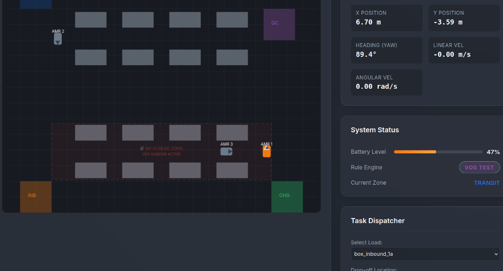

# Synapse AMR Warehouse Simulation (ROS 2 Humble + Gazebo)

A simulation of an industrial Autonomous Mobile Robot (AMR) inside a modern warehouse facility in Gazebo Classic with preloaded templates, inventory databases, waypoint stations, and extensible rule engine hooks.



---

## 🚀 Quick Start Commands

From this directory (`/home/akil/Desktop/synapse_mesh`):

### 1. Launch the Full Simulation (Gazebo + RViz + AMR)
```bash
./run_simulation.sh
```
*Spawns the AMR at the Charging Dock inside the warehouse, starts the sensors (360° LiDAR, Depth Camera, IMU, Odometry), activates the 2D warehouse map server, and opens RViz2.*

*To run without RViz or Gazebo GUI:*
```bash
./run_simulation.sh rviz:=false
./run_simulation.sh gui:=false rviz:=false
```

---

### 2. Drive the AMR (Keyboard Teleoperation)
In a new terminal:
```bash
./run_teleop.sh
```
Controls:
- `w` / `s` : Increase / Decrease linear speed (forward/backward)
- `a` / `d` : Steer left / right
- `space` / `x` : Emergency Stop
- `q` : Quit

---

### 3. Run the AMR Rule Engine & Dispatch Framework
In a new terminal:
```bash
./run_rule_engine.sh
```
*Evaluates warehouse rules at 10 Hz, checks front sensor safety distances, tracks battery levels, and dispatches pending pick orders by priority.*

---

## 📂 Preloaded Data & Templates

| File | Purpose | Preloaded Contents |
| :--- | :--- | :--- |
| [`data/inventory_data.json`](file:///home/akil/Desktop/synapse_mesh/src/synapse_amr_warehouse/data/inventory_data.json) | Warehouse Inventory Database | 7 SKUs with rack IDs, pallet IDs, weights, stock counts, priority levels, and target stations |
| [`data/warehouse_stations.yaml`](file:///home/akil/Desktop/synapse_mesh/src/synapse_amr_warehouse/data/warehouse_stations.yaml) | Pre-mapped Waypoint Stations | 15 stations including Charging Dock, Inbound Dock, Outbound Staging, QC Table, and Aisle A/B Storage Bays |
| [`data/amr_specs.json`](file:///home/akil/Desktop/synapse_mesh/src/synapse_amr_warehouse/data/amr_specs.json) | AMR Hardware & Kinematics Profile | Mass (50 kg), Payload (250 kg), Max speeds (1.5 m/s, 1.8 rad/s), Battery specs, and sensor topics |
| [`maps/warehouse_map.yaml`](file:///home/akil/Desktop/synapse_mesh/src/synapse_amr_warehouse/maps/warehouse_map.yaml) | 2D Occupancy Grid Map | 520x400 cell map at 0.05 m/cell matching the exact Gazebo world geometry |

---

## 🤖 Robot Specifications (`synapse_amr`)

- **Chassis**: Industrial low-profile differential drive (0.85m x 0.60m x 0.32m).
- **Wheels**: Dual center traction drive wheels + 4 low-friction caster ball supports for zero-slip stability.
- **Sensors**:
  - `360° LiDAR`: Topic `/scan` (range 0.15m - 20.0m, 15 Hz)
  - `Forward RGB-D Camera`: Topics `/camera/image_raw`, `/camera/depth/image_raw`, `/camera/points`
  - `6-DoF IMU`: Topic `/imu/data` (50 Hz)
  - `Wheel Odometry`: Topic `/odom` (50 Hz) broadcasting `odom` ➔ `base_footprint` TF
- **Actuation**: Listens to standard geometry Twist commands on `/cmd_vel`.

---

## 🏭 Warehouse Layout Elements & Models

- **Industrial Pallet Racks**: Multi-tier heavy-duty storage racks forming Aisle A and Aisle B.
- **Euro-Pallets**: 1200mm x 800mm industrial wooden pallets placed in storage bays and dock zones.
- **Cargo Boxes**: Corrugated parcels with barcode shipping labels stacked on pallets.
- **AMR Autonomous Charging Dock**: Docking station with inductive pads, status beacon, and alignment target.
- **Safety Bollards**: High-contrast safety posts protecting rack corners and docking corridors.

---

## 🧩 Adding Custom Rules

Open [`src/synapse_amr_warehouse/scripts/amr_rule_engine.py`](file:///home/akil/Desktop/synapse_mesh/src/synapse_amr_warehouse/scripts/amr_rule_engine.py) and add your custom logic inside the hook methods:
- `rule_safety_collision_check()`
- `rule_battery_management()`
- `rule_dispatch_by_priority()`
- Or define new methods and register them in `evaluate_rules()`.
